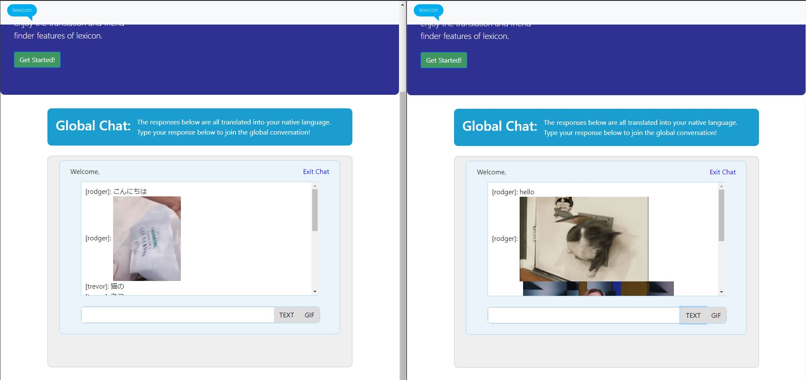

# Lexicon
### Lexicon translation app
### A global chat room that allows you to talk to people from around the world in your native language

> This is an example of the lexicon appplication

> In it "Rodger" is saying 'Hello', and on the screen of "義気", it translates it to 'こんにちは'

###### However with this application, if you make more than 40 translation requests, you will run into CORS issues. This would be avoided had a purchase to google tranlsate API been made. However, since this is a proof of concept, no purchase was made.
